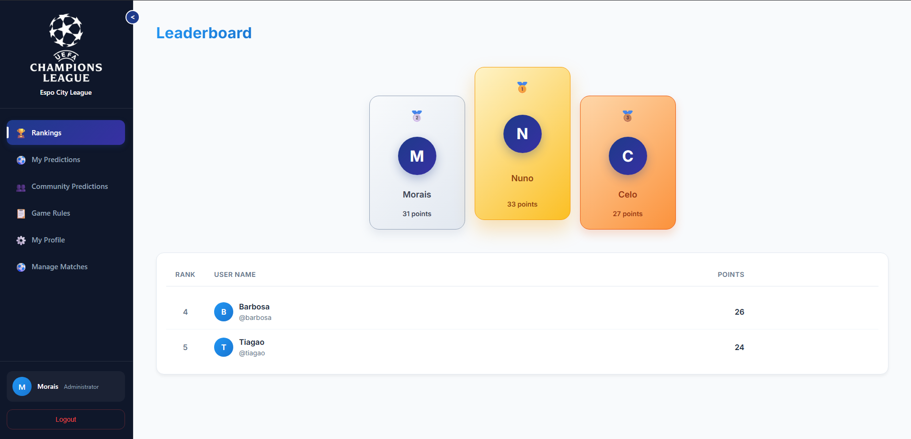
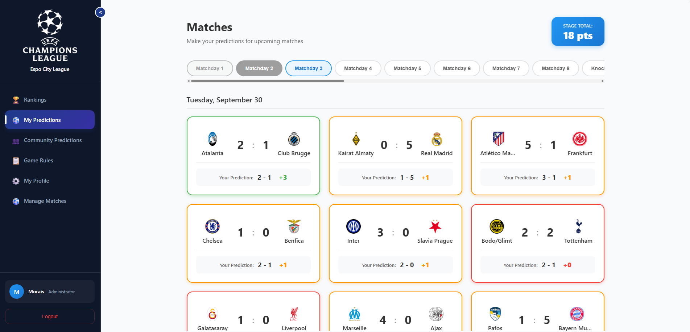
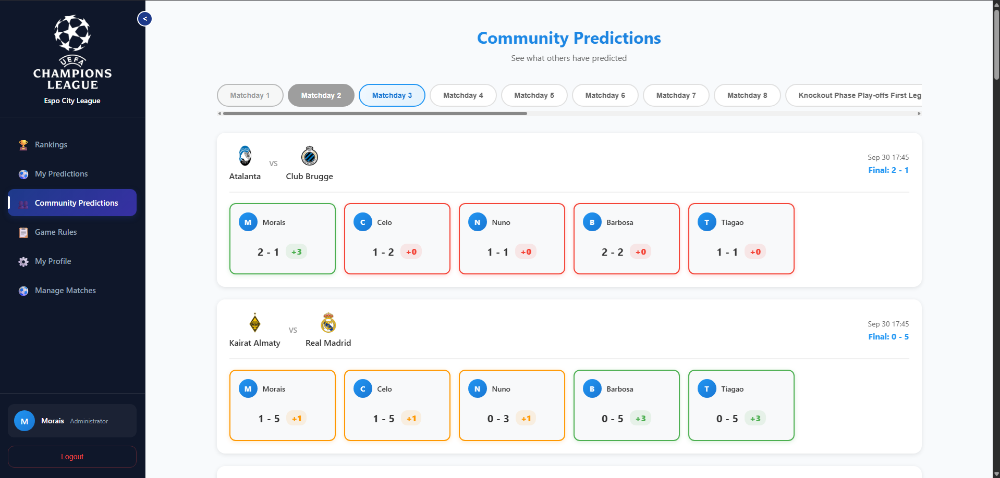
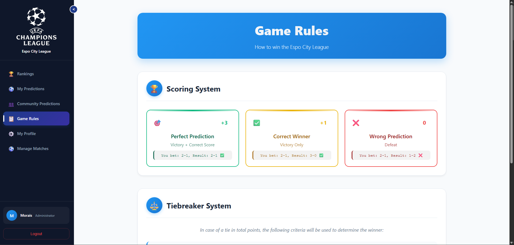
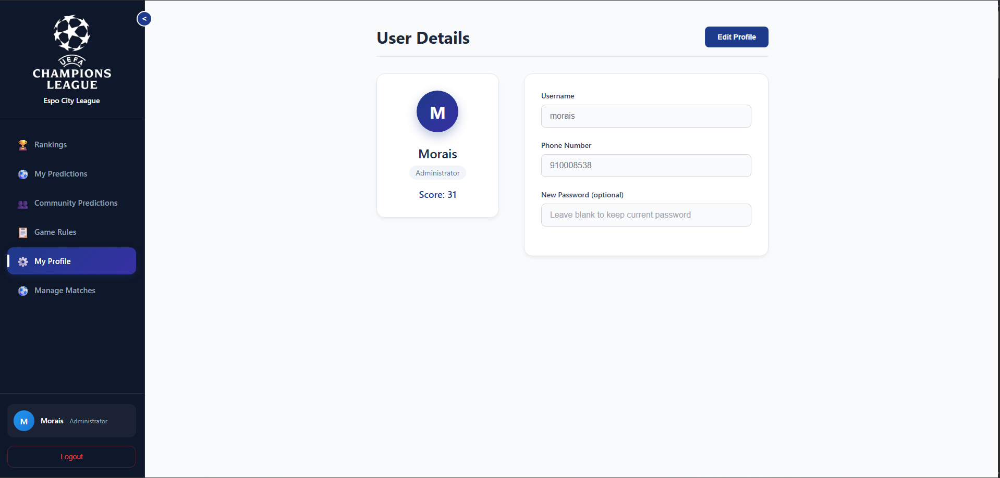
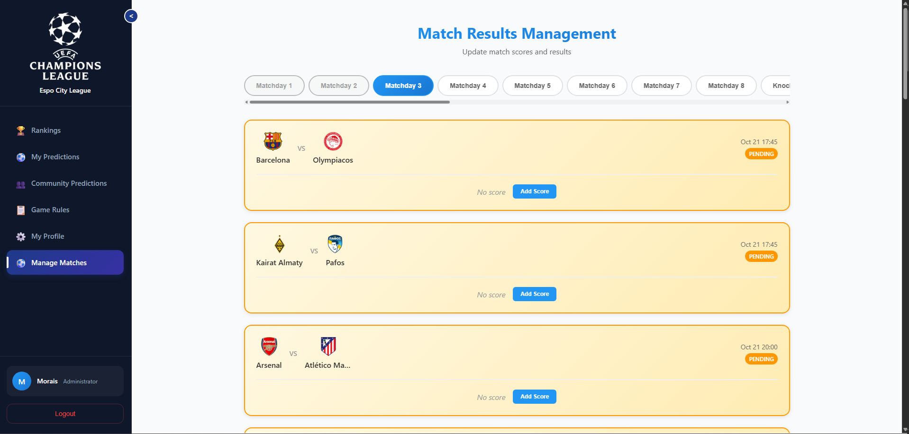

# ⚽ Espo City League

<div align="center">


**A modern football prediction league platform built with FastAPI and React**

[](https://fastapi.tiangolo.com/)
[](https://reactjs.org/)
[](https://www.typescriptlang.org/)
[](https://www.postgresql.org/)
[](https://www.docker.com/)

</div>

## 📋 Table of Contents

- [🎯 Overview](#-overview)
- [🌐 Try the Live Application](#-try-the-live-application)
- [📸 Screenshots](#-screenshots)
- [✨ Features](#-features)
- [🚀 Quick Start](#-quick-start)
- [🎮 Usage Guide](#-usage-guide)
- [🏆 Scoring System](#-scoring-system)
- [📄 License](#-license)

## 🎯 Overview

Espo City League is a comprehensive football prediction platform where users can make predictions on UEFA matches and compete with friends. The platform features real-time match updates, leaderboards, and an intuitive admin panel for match management.

### 🌟 Key Highlights

- **Real-time Predictions**: Make predictions before matches start
- **Smart Scoring System**: Points based on prediction accuracy
- **Dynamic Leaderboards**: Track your performance against other players
- **Admin Dashboard**: Manage matches and update results
- **Responsive Design**: Works seamlessly on desktop and mobile
- **Collapsible Sidebar**: Space-efficient navigation

## 🌐 Try the Live Application

**Ready to play?** Visit the live application at [https://espocity-league.mooo.com/login](https://espocity-league.mooo.com/login)

## 📸 Screenshots

### 🏆 Rankings
<div align="center">
  
  <p><em>Real-time leaderboard with scoring and rankings</em></p>
</div>

### ⚽ My Predictions
<div align="center">
  
  <p><em>Making predictions on upcoming matches with intuitive interface</em></p>
</div>

<div align="center">
  
  <p><em>Alternative view of match predictions and upcoming games</em></p>
</div>

### 👥 Community Predictions
<div align="center">
  
  <p><em>Viewing other players' predictions and community engagement</em></p>
</div>

### 📋 Game Rules
<div align="center">
  
  <p><em>Clear explanation of scoring system and game rules</em></p>
</div>

### ⚙️ User Profile
<div align="center">
  
  <p><em>User profile management and account settings</em></p>
</div>

### ⚽ Manage Matches
<div align="center">
  
  <p><em>Admin interface for managing matches and updating results</em></p>
</div>


## ✨ Features

### 🎮 User Features
- **Match Predictions**: Predict home and away team scores
- **Real-time Updates**: See match results as they happen
- **Personal Dashboard**: Track your prediction history
- **Community View**: See other players' predictions
- **Leaderboard**: Compete with friends and track rankings
- **Profile Management**: Update your account information

### 👨‍💼 Admin Features
- **Match Management**: Create and update match results
- **User Management**: View and manage user accounts
- **Stage Organization**: Organize matches by stages/matchdays
- **Real-time Scoring**: Automatic point calculation
- **Data Analytics**: Track platform usage and engagement

### 🎨 UI/UX Features
- **Modern Design**: Clean, intuitive interface
- **Dark Theme**: Easy on the eyes with professional styling
- **Collapsible Sidebar**: Maximize content space when needed
- **Responsive Layout**: Optimized for all screen sizes
- **Smooth Animations**: Polished user experience
- **Tooltips & Help**: Contextual guidance throughout the app


## 🚀 Quick Start

### 🛠️ Local Development Setup

#### Prerequisites
- Python 3.9+
- Node.js 16+
- PostgreSQL 13+
- Docker (optional)

### 1. Clone the Repository
```bash
git clone https://github.com/yourusername/espo-city-league.git
cd espo-city-league
```

### 2. Backend Setup
```bash
cd backend

# Run with Docker Compose
docker-compose up --build
```

### 3. Frontend Setup
```bash
cd frontend

# Run with Docker Compose
docker-compose up --build
```

### 4. Access the Application
- **Frontend**: http://localhost:3000
- **Backend API**: http://localhost:8000/api
- **API Docs**: http://localhost:8000/docs

## 🎮 Usage Guide

### Making Predictions
1. Navigate to "My Predictions" in the sidebar
2. Select a stage/matchday
3. Click "Predict" on upcoming matches
4. Enter your predicted scores
5. Click "Save" to submit

### Viewing Results
1. Go to "My Predictions" to see your history
2. Check "Community Predictions" to see others' picks
3. Visit "Rankings" to see the leaderboard
4. Points are automatically calculated when matches finish

### Admin Functions
1. Access "Manage Matches" (admin only)
2. Select a stage to view matches
3. Click "Add Score" or "Edit" to update results
4. Scores are automatically saved and points calculated

## 👥 User Roles

### 🎯 Player
- Make predictions on upcoming matches
- View personal prediction history
- See community predictions
- Track leaderboard rankings
- Update profile information

### 👨‍💼 Administrator
- All player features
- Update match results
- Manage match schedules
- View all user data
- Access admin dashboard

## 🏆 Scoring System

The platform uses a color-coded scoring system:

| Result | Points | Description |
|--------|--------|-------------|
| 🟢 **GREEN** | **3 points** | Exact score match |
| 🟡 **YELLOW** | **1 point** | Correct result (win/draw/loss) but wrong score |
| 🔴 **RED** | **0 points** | Wrong result |

### Example Scoring
- **Prediction**: Arsenal 2-1 Chelsea
- **Actual**: Arsenal 2-1 Chelsea → **3 points** (GREEN)
- **Actual**: Arsenal 3-0 Chelsea → **1 point** (YELLOW - correct Arsenal win)
- **Actual**: Chelsea 1-0 Arsenal → **0 points** (RED - wrong result)


## 📄 License

This project is licensed under the MIT License - see the [LICENSE](LICENSE) file for details.
