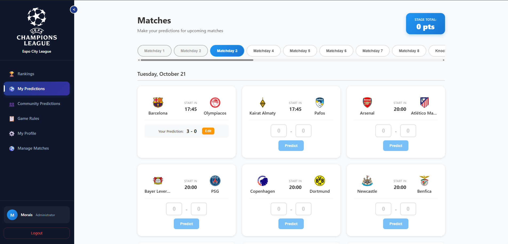

# ⚽ Espo City League

<div align="center">


**A modern football prediction league platform built with FastAPI and React**

[](https://fastapi.tiangolo.com/)
[](https://reactjs.org/)
[](https://www.typescriptlang.org/)
[](https://www.postgresql.org/)
[](https://www.docker.com/)

</div>

## 📋 Table of Contents

- [🎯 Overview](#-overview)
- [📸 Screenshots](#-screenshots)
- [✨ Features](#-features)
- [🚀 Quick Start](#-quick-start)
- [🎮 Usage Guide](#-usage-guide)
- [🏆 Scoring System](#-scoring-system)
- [📁 Project Structure](#-project-structure)
- [🛠️ Development](#️-development)
- [📄 License](#-license)

## 🎯 Overview

Espo City League is a comprehensive football prediction platform where users can make predictions on UEFA matches and compete with friends. The platform features real-time match updates, leaderboards, and an intuitive admin panel for match management.

### 🌟 Key Highlights

- **Real-time Predictions**: Make predictions before matches start
- **Smart Scoring System**: Points based on prediction accuracy
- **Dynamic Leaderboards**: Track your performance against other players
- **Admin Dashboard**: Manage matches and update results
- **Responsive Design**: Works seamlessly on desktop and mobile
- **Collapsible Sidebar**: Space-efficient navigation

## 📸 Screenshots

### 🏆 Rankings
<div align="center">
  
  <p><em>Real-time leaderboard with scoring and rankings</em></p>
</div>

### ⚽ My Predictions
<div align="center">
  
  <p><em>Making predictions on upcoming matches with intuitive interface</em></p>
</div>

<div align="center">
  
  <p><em>Alternative view of match predictions and upcoming games</em></p>
</div>

### 👥 Community Predictions
<div align="center">
  
  <p><em>Viewing other players' predictions and community engagement</em></p>
</div>

### 📋 Game Rules
<div align="center">
  
  <p><em>Clear explanation of scoring system and game rules</em></p>
</div>

### ⚙️ User Profile
<div align="center">
  
  <p><em>User profile management and account settings</em></p>
</div>

### ⚽ Manage Matches
<div align="center">
  
  <p><em>Admin interface for managing matches and updating results</em></p>
</div>


## ✨ Features

### 🎮 User Features
- **Match Predictions**: Predict home and away team scores
- **Real-time Updates**: See match results as they happen
- **Personal Dashboard**: Track your prediction history
- **Community View**: See other players' predictions
- **Leaderboard**: Compete with friends and track rankings
- **Profile Management**: Update your account information

### 👨‍💼 Admin Features
- **Match Management**: Create and update match results
- **User Management**: View and manage user accounts
- **Stage Organization**: Organize matches by stages/matchdays
- **Real-time Scoring**: Automatic point calculation
- **Data Analytics**: Track platform usage and engagement

### 🎨 UI/UX Features
- **Modern Design**: Clean, intuitive interface
- **Dark Theme**: Easy on the eyes with professional styling
- **Collapsible Sidebar**: Maximize content space when needed
- **Responsive Layout**: Optimized for all screen sizes
- **Smooth Animations**: Polished user experience
- **Tooltips & Help**: Contextual guidance throughout the app


## 🚀 Quick Start

### Prerequisites
- Python 3.9+
- Node.js 16+
- PostgreSQL 13+
- Docker (optional)

### 1. Clone the Repository
```bash
git clone https://github.com/yourusername/espo-city-league.git
cd espo-city-league
```

### 2. Backend Setup
```bash
cd backend

# Create virtual environment
python -m venv venv
source venv/bin/activate  # On Windows: venv\Scripts\activate

# Install dependencies
pip install -r requirements.txt

# Set up environment variables
cp .env.example .env
# Edit .env with your database credentials

# Run database migrations
alembic upgrade head

# Start the development server
uvicorn app.main:app --reload
```

### 3. Frontend Setup
```bash
cd frontend

# Install dependencies
npm install

# Start the development server
npm start
```

### 4. Access the Application
- **Frontend**: http://localhost:3000
- **Backend API**: http://localhost:8000/api
- **API Docs**: http://localhost:8000/docs

## 📁 Project Structure

```
espo-city-league/
├── 📁 backend/                 # FastAPI backend
│   ├── 📁 app/
│   │   ├── 📁 models/         # Database models
│   │   ├── 📁 routers/        # API endpoints
│   │   ├── 📁 dependencies/   # Auth & DB deps
│   │   └── 📁 db/            # Database config
│   ├── 📁 alembic/           # Database migrations
│   └── 📄 requirements.txt   # Python deps
├── 📁 frontend/               # React frontend
│   ├── 📁 src/
│   │   ├── 📁 components/    # UI components
│   │   ├── 📁 pages/        # Page components
│   │   ├── 📁 contexts/     # React contexts
│   │   ├── 📁 services/     # API services
│   │   └── 📁 utils/        # Utilities
│   └── 📄 package.json      # Node deps
├── 📁 docs/                  # Documentation & Screenshots
│   ├── 📁 screenshots/      # Application screenshots
│   ├── 📄 README.md         # Screenshot documentation
│   ├── 📄 screenshot-preview.html # Preview template
│   └── 📄 create-placeholders.py  # Placeholder generator
└── 📄 README.md             # This file
```


## 🎮 Usage Guide

### Making Predictions
1. Navigate to "My Predictions" in the sidebar
2. Select a stage/matchday
3. Click "Predict" on upcoming matches
4. Enter your predicted scores
5. Click "Save" to submit

### Viewing Results
1. Go to "My Predictions" to see your history
2. Check "Community Predictions" to see others' picks
3. Visit "Rankings" to see the leaderboard
4. Points are automatically calculated when matches finish

### Admin Functions
1. Access "Manage Matches" (admin only)
2. Select a stage to view matches
3. Click "Add Score" or "Edit" to update results
4. Scores are automatically saved and points calculated

## 👥 User Roles

### 🎯 Player
- Make predictions on upcoming matches
- View personal prediction history
- See community predictions
- Track leaderboard rankings
- Update profile information

### 👨‍💼 Administrator
- All player features
- Update match results
- Manage match schedules
- View all user data
- Access admin dashboard

## 🏆 Scoring System

The platform uses a color-coded scoring system:

| Result | Points | Description |
|--------|--------|-------------|
| 🟢 **GREEN** | **3 points** | Exact score match |
| 🟡 **YELLOW** | **1 point** | Correct result (win/draw/loss) but wrong score |
| 🔴 **RED** | **0 points** | Wrong result |

### Example Scoring
- **Prediction**: Arsenal 2-1 Chelsea
- **Actual**: Arsenal 2-1 Chelsea → **3 points** (GREEN)
- **Actual**: Arsenal 3-0 Chelsea → **1 point** (YELLOW - correct Arsenal win)
- **Actual**: Chelsea 1-0 Arsenal → **0 points** (RED - wrong result)

## 🛠️ Development

### 📸 Screenshots

The application screenshots are already included in the README, showcasing:

- **Match Predictions**: Interface for making predictions
- **Community Predictions**: Viewing other players' bets
- **Leaderboard**: Real-time rankings and scores
- **Admin Dashboard**: Match management interface
- **User Profile**: Account settings and management
- **Game Rules**: Scoring system explanation
- **Multiple Prediction Views**: Different interfaces for predictions

Screenshots are located in `docs/screenshots/` and automatically displayed in this README.

For detailed development instructions:

- **Backend Development**: See [backend/README.md](backend/README.md)
- **Frontend Development**: See [frontend/README.md](frontend/README.md)

## 📦 Deployment

### Docker Deployment
```bash
# Build and run with Docker Compose
docker-compose up --build

# Production deployment
docker-compose -f docker-compose.prod.yml up -d
```

### Manual Deployment
1. **Backend**: Deploy to your preferred Python hosting (Railway, Heroku, etc.)
2. **Frontend**: Build and deploy to Vercel, Netlify, or similar
3. **Database**: Set up PostgreSQL instance
4. **Environment**: Configure production environment variables


## 📄 License

This project is licensed under the MIT License - see the [LICENSE](LICENSE) file for details.

## 🙏 Acknowledgments

- **FastAPI** - Modern, fast web framework for building APIs
- **React** - A JavaScript library for building user interfaces
- **PostgreSQL** - The world's most advanced open source relational database
- **UEFA** - For providing the football match data inspiration
